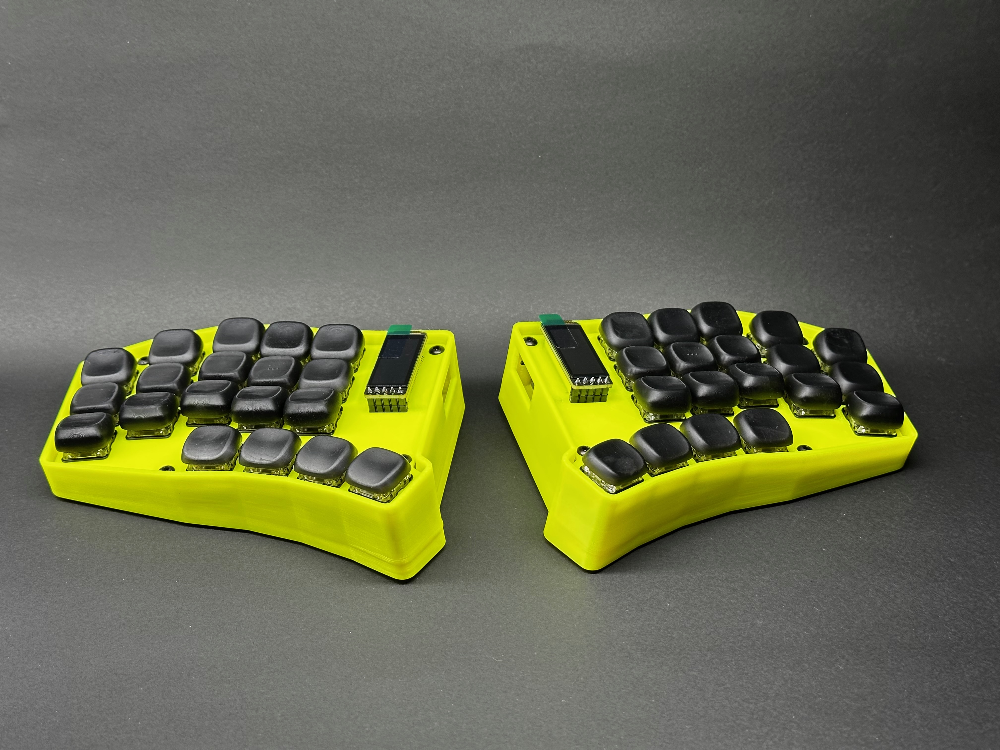

# Phrettboard v1

A simple split staggered colluminar layout ergonomic keyboard.



Design priorities:

- Wireless - Bluetooth with excellent battery life
- Compact - Small and light enough to travel while chunky enough to stay put on the desk
- Tenting - Slight tenting with ability to adjust tenting in post
- Travel - Able to throw in a backpack daily for work

## Project files and folders

The repo is essentially ergogen and zmk smashed together with little regard for preserving the GitHub actions support for the ZMK config.

## BOM

| Item | Quantity |
| --- | --- |
| M3x10 BHCS | 4 |
| M3x20 BHCS | 4 |
| [LiPo Battery 2000mAh 3.7V 113450](https://ecocell.com.au/product/lipo-2000-113450/) | 2 |
| PCB | 1 pair |
| Kailh Choc hotswap sockets | 38 |
| Kailh Choc switches of your choice | 38 |
| Keycaps of your choice to match (1U) | 38 |
| Diodes IN4148 SOD-123 | 38 |
| JST-PH 2P Side entry socket | 2 |
| Silicone dome feet 8.8mm x 2.5mm | 10 |
| NRF82840 or Nice Nano v2 dev board | 2 |
| Pin sockets - machine pin - 12pin | 4 |
| Pin headers - machine pin - 12pin | 4 |
| Nice!view LCD display | 2 |
| Pin sockets - machine pin - 5pin | 2 |
| Pin headers - machine pin - 5pin | 2 |
| EVQPUC02K 4.7*3.5*1.65 SMD Reset button | 2 |
| MSS3 SMD Sliding power switch | 2 |

## [Ergogen](https://github.com/ergogen/ergogen)

The keyboard layout is built in Ergogen, then routed in Kicad.

To modify the layout:

```shell
cd ergogen
make
```

This will generate files into the `ergogen/output/` folder for both outlines and PCBs. It will overwrite any existing routed PCBs and will require you to reroute again.

## 3D Printing

The 3D printed parts were generated in Fusion 360 based off the PCB step file exported from Kicad. The priority was a form fitting case with some minor tenting which conveniently worked out well to allow space underneath for a large battery alongside the controller. The two inner feet can also be removed to reveal extra heatset inserts that support using M3 screws to increase the hight for extra tenting.

The glamour shots all featue cases FDM printed in ABS and resing printed keycaps. If you decide to print your own keycaps check out [KLP Lame](https://www.printables.com/model/552557-klp-lame-kailh-low-profile-choc-keycaps) for good sculpted keycaps (designed for resin) and [Nijuni Keycaps](https://www.printables.com/model/429659) for flatter keycaps (designed for FDM).


If printing the case in ABS I recommend using scaling X & Y by 100.5% to compensate for material shrinkage.

The travel case is designed to be printed in TPU. It prints well in quite flexible TPU and has a lot of give in it. If printing in a different material you will most likely need to scale the model bigger or smaller.

## [ZMK firmware](https://zmk.dev/docs)

To setup the build environment with Docker installed, run:

```shell
cd zmk-config
./zmk.sh build-docker
```

The typical workflow to modify the keymap is to use the [keymap editor](https://nickcoutsos.github.io/keymap-editor/), select the Clipboard source with keyboard type of custom, paste in the contents of `zmk-config/boards/shields/phrett/phrett.json` into the layout field and `zmk-config/boards/shields/phrett/phrett.keymap` into the keymap field. Modify the keyboard layout as desired, click 'Copy updated keymap' and paste it back into the local keymap.

From there the firmware can be rebuilt using:

```shell
cd zmk-config
make
```

Then connect each keyboard half one at a time, put them into bootloader mode by double tapping reset, then copying to approperate firmware from `zmk-config/artifacts/phrett_{left,right}.uf2` to the now mounted controller volume.

## License

<p xmlns:cc="http://creativecommons.org/ns#" xmlns:dct="http://purl.org/dc/terms/"><a property="dct:title" rel="cc:attributionURL" href="https://github.com/agentk/phrettboard">Phrettboard v1</a> by <a rel="cc:attributionURL dct:creator" property="cc:attributionName" href="https://github.com/agentk">Karl Bowden</a> is licensed under <a href="https://creativecommons.org/licenses/by-sa/4.0/?ref=chooser-v1" target="_blank" rel="license noopener noreferrer" style="display:inline-block;">CC BY-SA 4.0</a></p>

